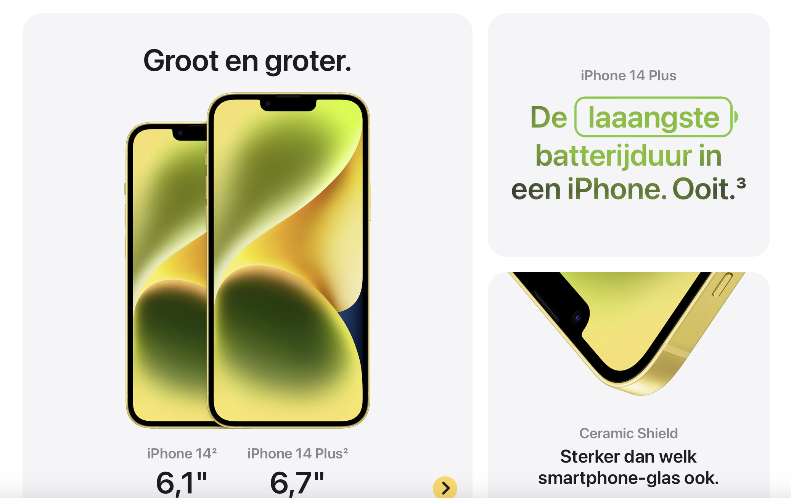
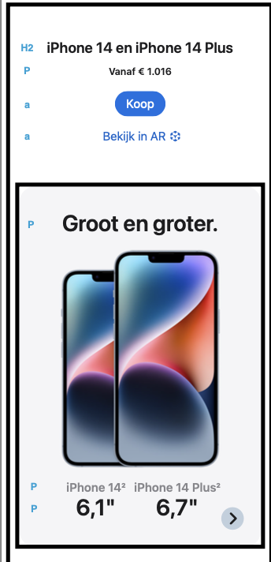
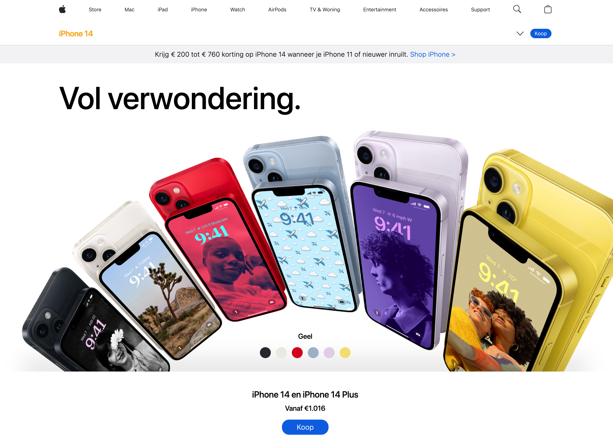
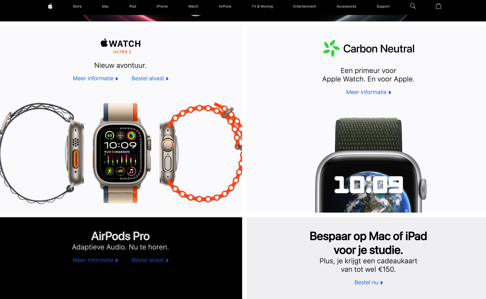
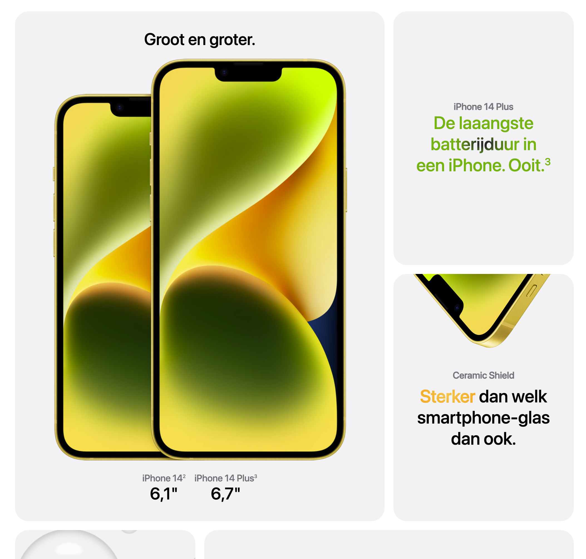

# Procesverslag
Markdown is een simpele manier om HTML te schrijven.  
Markdown cheat cheet: [Hulp bij het schrijven van Markdown](https://github.com/adam-p/markdown-here/wiki/Markdown-Cheatsheet).

Nb. De standaardstructuur en de spartaanse opmaak van de README.md zijn helemaal prima. Het gaat om de inhoud van je procesverslag. Besteedt de tijd voor pracht en praal aan je website.

Nb. Door *open* toe te voegen aan een *details* element kun je deze standaard open zetten. Fijn om dat steeds voor de relevante stuk(ken) te doen.

## Jij

  
uitwerken voor kick-off werkgroep

  ### Auteur:
  Binc van Buren (vervangen door jouw naam)

  #### Je startniveau:
  Rood (kies uit zwart, rood óf blauw)

  #### Je focus:
  Surface laag (kies uit responsive óf surface plane)
 

## Je website

  
uitwerken voor kick-off werkgroep

  ### Je opdracht:
  https://www.apple.com/nl/

  #### Screenshot(s) van de eerste pagina (small screen): 
  Detail pagina iPhone 14
  

  #### Screenshot(s) van de tweede pagina (small screen):
  hier de naam van de pagina  
  
 

## Toegankelijkheidstest 1/2 (week 1)

  
uitwerken na test in 2e werkgroep

  ### Bevindingen
  Lijst met je bevindingen die in de test naar voren kwamen:

  De website van Apple bevat best veel beeldspraak, en bepaalde metaforen. Dit zou voor sommige mensen als vervelend kunnen worden ervaren. Ook worden vele headings en paragraven op verschillende manieren gestijld, en zit er soms geen zelfde stijl in. Veel media speelt automatisch af en er is spraak van veel bewegende elementen. Er is geen mogelijkheid om de beweging te verminderen. Verder worden contrasten goed toegepast en is alles duidelijk te lezen. De wesbite is zeer responsive en past zich aan voor vele apparaten en rotaties. 

## Breakdownschets (week 1)

  
uitwerken na afloop 3e werkgroep

  ### de hele pagina: 
  

## Voortgang 1 (week 2)

  
uitwerken voor 1e voortgang

  ### Stand van zaken
Tot nu toe gaat het me best goed af met coderen. Ik moest het een en ander even opfrissen, maar als ik de oefeningen doe en naar oudere projecten kijk, kom ik er vaak uit. Momenteel zoek ik uitdaging in de responsiveheid en ben ik aan de slag gegaan met Javascript, om de website wat dyanmischer te maken.

  ### Agenda voor meeting
Tijdens de meeting zullen we het gaan hebben over de dingen waar we momenteel tegen aan lopen.

  ### Verslag van meeting
Tijdens de meeting zijn we ingegaan op diverse onderdelen als Grid en Flexbox en hebben we elkaar geholpen waar nodig.

## Voortgang 2 (week 3)

  
uitwerken voor 2e voortgang

  ### Stand van zaken
Deze week gaat het ook goed met coderen, en zit de flow er lekker in. Ik heb het Grid door en ben ook bezig met de Media Queries om de website responisve te maken! Onder andere de navigatie balk en footer ben ik nu responsive aan het maken.

  ### Agenda voor meeting
Tijdens de meeting zullen we het gaan hebben over de dingen waar we momenteel tegen aan lopen en wat goed gaat!

  ### Verslag van meeting
Tijdens dit gesprek heb ik een aantal tips gekregen om mijn website nog beter te maken. Het ging andere andere over de website interactiever maken, hover effecten toevoegen, dark mode overwgeen en focus state toevoegen aan de website.

## Toegankelijkheidstest 2/2 (week 4)

  
uitwerken na test in 9e werkgroep

  ### Bevindingen
Tijdens de toegankelijkheids test kwamen we tot een aantal verbeteringen en een aantal dingen die ik nog moet verbeteren. Wat ik beter heb dan de ogirinele website is de mogelijkheid voor reduces motion, reduces transparency en dark mode. Een aantal aandachtspunten zijn: h1 toevoegen aan alle pagina's, de navigatie omzetten tot een UL, invisible headers toevoegen voor de screen reader op plekken waar alleen afbeeldingen te vinden zijn.

## Voortgang 3 (week 4)

  
uitwerken voor 3e voortgang

  ### Stand van zaken
De website is bijna af en de meeste dingen heb ik tot nu toe uitgewerkt. 

  ### Agenda voor meeting
Tijdens deze meeting hebben we het over de laatste puntjes op de i.

  ### Verslag van meeting
Tijdens deze meesting hebben we het gehad over kleine dingen die ik nog kan toevoegen, zoals leuke effecten. De website is namelijk bijna zo goed als af!

## Eindgesprek (week 5)

  
uitwerken voor eindgesprek

  ### Je uitkomst - karakteristiek screenshots:
  

  ### Dit ging goed/Heb ik geleerd: 
Deze opdracht heeft mij heel veel geleerd! Van grid, tot responsive en van animaties tot aan toegankelijkheid. Allemaal nieuwe dingen die ik geleerd heb tijdens dit vak. 

  

  ### Dit was lastig/Is niet gelukt:
Ik struggelde hier en daar af en toe met uitlijning van bepaalde elementen. Ik vond vaak felxbox een beetje apart werken, en moest het soms 10x proberen voordat iets lukte. Het is veel proberen en proberen totdat het lukt. Ook met Javascript zat ik soms een beetje te knoeien, maar uiteindelijk is het allemaal gelukt!

  

## Bronnenlijst

  
continu bijhouden terwijl je werkt

https://www.w3schools.com/cssref/pr_grid-row-start.php
https://www.w3schools.com/cssref/css3_pr_transform.php
https://www.w3schools.com/jsref/prop_style_backgroundimage.asp
https://www.w3schools.com/cssref/css3_pr_align-self.php
https://www.w3schools.com/cssref/css3_pr_text-shadow.php
https://www.w3schools.com/cssref/pr_grid-column-start.php
https://www.w3schools.com/css/css3_transitions.asp
https://www.w3schools.com/cssref/css3_pr_backdrop-filter.php
https://www.w3schools.com/css/css3_flexbox_responsive.asp
https://www.w3schools.com/jsref/prop_style_backgroundposition.asp
https://www.w3schools.com/cssref/css3_pr_animation.php
https://www.w3schools.com/css/css_border.asp
https://stackoverflow.com/questions/29516971/how-do-i-cycle-through-pictures-in-javascript
https://www.w3schools.com/jsref/dom_obj_pushbutton.asp

